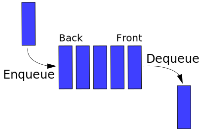

# Queue

First In First Out, 선입선출의 선형 자료구조 입니다.

### 구현

저장소의 size 혹은 length를 의미하는 count의 초기값을 0으로 할당합니다.

1. Enqueue(insert) : 저장소의 count 자리에 값을 할당합니다. 이후 count는 1 증가 합니다.
2. Dequeue(delete) : 배열의 첫번째 항목을 제거하고 반환합니다. count는 1 감소하고 배열의 모든 항목의 위치가 1 감소합니다.
3. Front : 배열의 첫번째 항목을 반환합니다.
4. Rear : 배열의 count 자리(마지막) 항목을 반환합니다.
