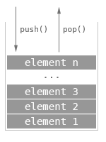

# Stack

Last In First Out, 후입선출의 선형 자료구조 입니다.

브라우저에서 접속한 웹페이지 기록이 stack으로 구현되어 뒤로가기를 하면 최상단 기록인 현재 페이지에서 이전 페이지로 돌아가게 됩니다.

### 구현

저장소의 size 혹은 length를 의미하는 count의 초기값을 0으로 할당합니다.

1. Push : 저장소의 count 자리에 값을 할당합니다. 이후 count는 1 증가 합니다.
2. Pop: : 저장소의 count - 1 자리의 값을 삭제합니다. 이후 count는 1 감소 합니다.
3. Peek : 저장소의 count - 1 자리의 값을 반환합니다.
